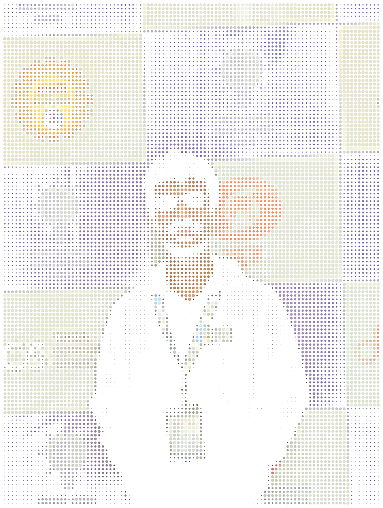
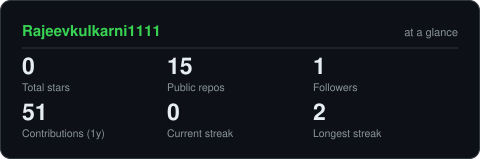
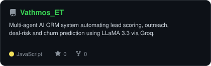
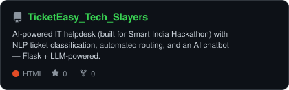
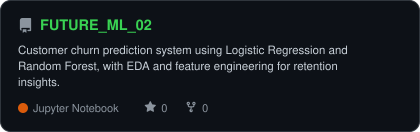
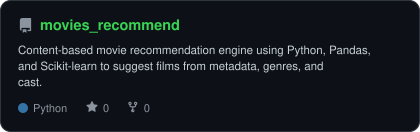

<div align="center">


# Rajeev Kulkarni


<a href="https://github.com/Rajeevkulkarni1111">
  
</a>

<a href="https://www.linkedin.com/in/rajeev-kulkarni-054008269">
  
</a>

<a href="mailto:rajeevkulkarni1111@gmail.com">
  
</a>


</div>

---

## `~/` whoami

```console
$ cat about.txt
```
---

<h2 align="center">Contribution Snake</h2>

<p align="center">
  <picture>
    <source media="(prefers-color-scheme: dark)" srcset="https://raw.githubusercontent.com/Rajeevkulkarni1111/Rajeevkulkarni1111/output/snake-dark.svg">
    <source media="(prefers-color-scheme: light)" srcset="https://raw.githubusercontent.com/Rajeevkulkarni1111/Rajeevkulkarni1111/output/snake.svg">
    
  </picture>
</p>

<h3 align="center">🛠️ Toolbox</h3>

<p align="center">
  
</p>

<table>
<tr>

<td width="50%" align="center">

<p><strong>What I Think I Know</strong></p>

<picture>
  <source media="(prefers-color-scheme: dark)" srcset="assets/radar-dark.svg">
  <source media="(prefers-color-scheme: light)" srcset="assets/radar-light.svg">
  
</picture>

</td>

<td width="50%" align="center">

<p><strong>What I Actually Code</strong></p>

<picture>
  <source media="(prefers-color-scheme: dark)" srcset="assets/radar-langs-dark.svg">
  <source media="(prefers-color-scheme: light)" srcset="assets/radar-langs-light.svg">
  
</picture>

</td>

</tr>
</table>

<h2 align="center">GitHub Stats</h2>

<p align="center">
  <picture>
    <source media="(prefers-color-scheme: dark)" srcset="assets/card-stats-dark.svg">
    <source media="(prefers-color-scheme: light)" srcset="assets/card-stats-light.svg">
    
  </picture>
</p>

<h2 align="center">Featured Projects</h2>

<table>
<tr>

<td width="50%" align="center">

<a href="https://github.com/Rajeevkulkarni1111/Vathmos_ET">
<picture>
  <source media="(prefers-color-scheme: dark)" srcset="assets/card-Vathmos_ET-dark.svg">
  <source media="(prefers-color-scheme: light)" srcset="assets/card-Vathmos_ET-light.svg">
  
</picture>
</a>

</td>

<td width="50%" align="center">

<a href="https://github.com/Rajeevkulkarni1111/TicketEasy_Tech_Slayers">
<picture>
  <source media="(prefers-color-scheme: dark)" srcset="assets/card-TicketEasy_Tech_Slayers-dark.svg">
  <source media="(prefers-color-scheme: light)" srcset="assets/card-TicketEasy_Tech_Slayers-light.svg">
  
</picture>
</a>

</td>

</tr>

<tr>

<td width="50%" align="center">

<a href="https://github.com/Rajeevkulkarni1111/FUTURE_ML_02">
<picture>
  <source media="(prefers-color-scheme: dark)" srcset="assets/card-FUTURE_ML_02-dark.svg">
  <source media="(prefers-color-scheme: light)" srcset="assets/card-FUTURE_ML_02-light.svg">
  
</picture>
</a>

</td>

<td width="50%" align="center">

<a href="https://github.com/Rajeevkulkarni1111/movies_recommend">
<picture>
  <source media="(prefers-color-scheme: dark)" srcset="assets/card-movies_recommend-dark.svg">
  <source media="(prefers-color-scheme: light)" srcset="assets/card-movies_recommend-light.svg">
  
</picture>
</a>

</td>

</tr>
</table>

<sub>

| Project | Stack | Repository |
|---|---|---|
| [Vathmos_ET](https://github.com/Rajeevkulkarni1111/Vathmos_ET) | JavaScript | [GitHub](https://github.com/Rajeevkulkarni1111/Vathmos_ET) |
| [TicketEasy_Tech_Slayers](https://github.com/Rajeevkulkarni1111/TicketEasy_Tech_Slayers) | HTML | [GitHub](https://github.com/Rajeevkulkarni1111/TicketEasy_Tech_Slayers) |
| [FUTURE_ML_02](https://github.com/Rajeevkulkarni1111/FUTURE_ML_02) | Jupyter Notebook | [GitHub](https://github.com/Rajeevkulkarni1111/FUTURE_ML_02) |
| [movies_recommend](https://github.com/Rajeevkulkarni1111/movies_recommend) | Python | [GitHub](https://github.com/Rajeevkulkarni1111/movies_recommend) |

</sub>
